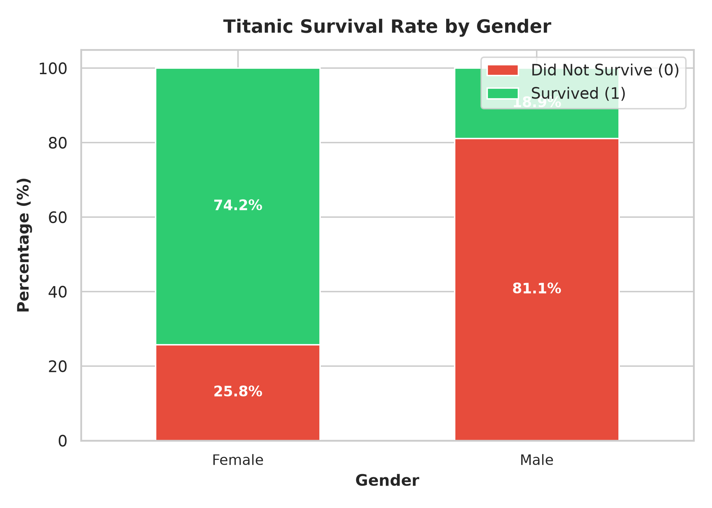
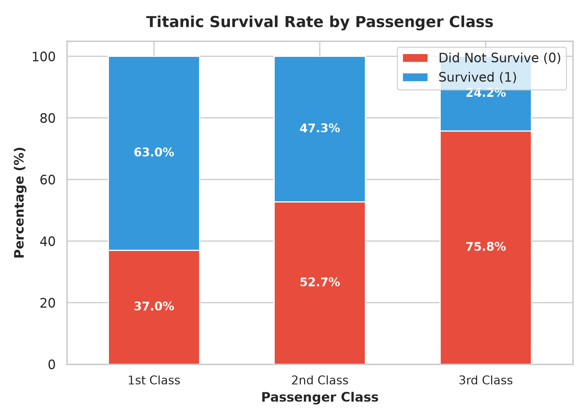
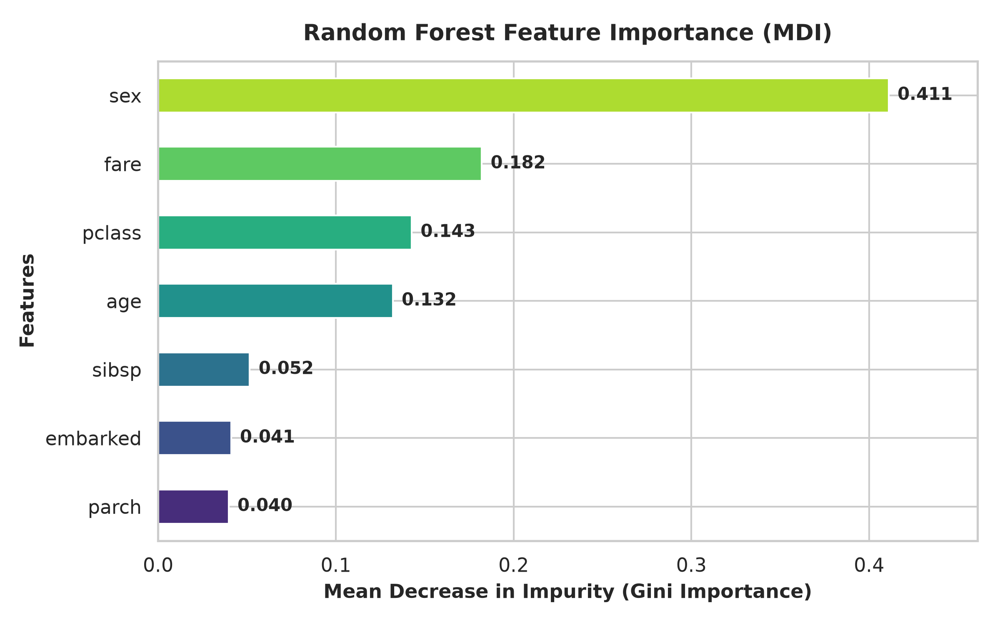
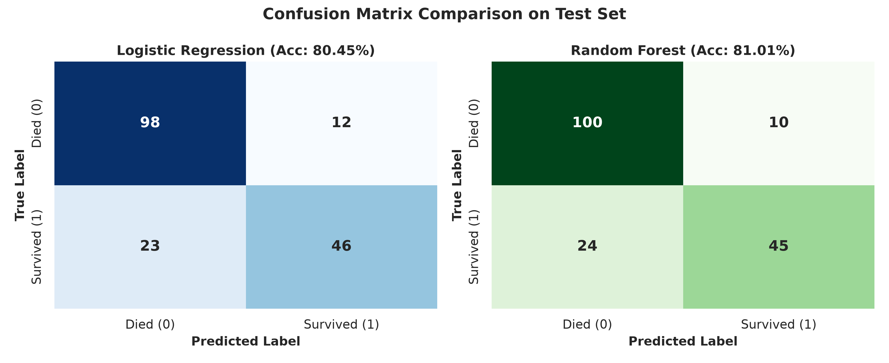

# 🚢 Titanic Survival Prediction — Binary Classification with scikit-learn

An end-to-end machine learning project predicting passenger survival on the Titanic using supervised binary classification techniques in Python.


---

## 📌 Problem Statement
The sinking of the RMS Titanic on April 15, 1912, is one of the deadliest maritime disasters in history, resulting in the loss of over 1,500 lives out of 2,224 passengers and crew. While there was an element of chance involved in survival, historical accounts indicate that certain groups—particularly women, children, and the upper class—had substantially higher survival rates than others.

The objective of this project is to build a machine learning model using **scikit-learn** that analyzes demographic, ticket, and travel characteristics to predict whether a given passenger survived the disaster.

---

## 📊 Dataset Source
The data used in this project is the famous **Titanic Dataset**, available via:
- [Kaggle Titanic: Machine Learning from Disaster](https://www.kaggle.com/c/titanic/data)
- Direct Seaborn repository distribution: [`seaborn.load_dataset('titanic')`](https://github.com/mwaskom/seaborn-data/blob/master/titanic.csv)

A clean local snapshot is stored in the repository under [`data/titanic.csv`](data/titanic.csv).

---

## 🛠️ Tech Stack
- **Language:** Python 3.10+
- **Machine Learning Library:** [scikit-learn](https://scikit-learn.org/) (Logistic Regression, Random Forest Classifier, Model Evaluation Metrics)
- **Data Manipulation:** [pandas](https://pandas.pydata.org/), [NumPy](https://numpy.org/)
- **Data Visualization:** [matplotlib](https://matplotlib.org/), [seaborn](https://seaborn.pydata.org/)
- **Interactive Environment:** Jupyter Notebook

---

## 🚀 Steps Followed
1. **Exploratory Data Analysis (EDA):**
   - Examined dataset structure using `.head()`, `.info()`, and `.describe()`.
   - Identified missing value patterns: `age` had ~20% missing values, `embarked` had 2 missing values, and `deck`/`cabin` was ~77% missing.
2. **Data Cleaning & Imputation:**
   - Handled missing values using domain-appropriate statistical imputation:
     - Missing `age` values imputed with the **median** (robust against age outliers).
     - Missing `embarked` ports imputed with the **mode** (`'S'` for Southampton).
   - Removed redundant, derived, or heavily incomplete columns (`deck`, `alive`, `class`, `embark_town`, `who`, `adult_male`, `alone`, `name`, `ticket`, `cabin`, `passengerid`) to prevent data leakage and noise.
3. **Categorical Feature Encoding:**
   - Encoded `sex` numerically (`male` $\rightarrow$ 0, `female` $\rightarrow$ 1).
   - Encoded `embarked` port numerically (`S` $\rightarrow$ 0, `C` $\rightarrow$ 1, `Q` $\rightarrow$ 2).
4. **Data Splitting:**
   - Separated features from target variable (`survived`).
   - Performed an **80/20 train/test split** with `random_state=42` to guarantee exact reproducibility across runs.
5. **Model Training & Comparison:**
   - Trained a linear baseline: **Logistic Regression**.
   - Trained a non-linear ensemble: **Random Forest Classifier** (`n_estimators=100`, `max_depth=6`).
6. **Evaluation & Visualization:**
   - Assessed accuracy, confusion matrices, precision, recall, and F1-score on unseen test data.
   - Plotted feature importances and demographic survival rates.
7. **Production Inference Function:**
   - Built a reusable Python function `predict_survival(passenger_data)` that accepts raw passenger inputs and outputs a predicted class along with a confidence probability.

---

## 💻 How to Run This Project

### 1. Clone the repository
```bash
git clone https://github.com/vinitkumarpatil/titanic-survival-prediction.git
cd titanic-survival-prediction
```

### 2. Set up a Python virtual environment
```bash
# Windows
python -m venv .venv
.\.venv\Scripts\activate

# macOS / Linux
python3 -m venv .venv
source .venv/bin/activate
```

### 3. Install required dependencies
```bash
pip install -r requirements.txt
```

### 4. Launch Jupyter Notebook
```bash
jupyter notebook notebooks/titanic_survival_prediction.ipynb
```
Run all cells from top to bottom (`Kernel` $\rightarrow$ `Restart & Run All`) to see the step-by-step analysis and outputs.

### 5. Launch Interactive Web Application
```bash
python app.py
```
Open your web browser and navigate to `http://127.0.0.1:5000` to interact with the live prediction dashboard!

---

## 📈 Results

Both models were evaluated on the held-out test set (179 passengers, 20% split).

| Model | Test Accuracy | Precision (Survived) | Recall (Survived) | F1-Score (Survived) |
|---|:---:|:---:|:---:|:---:|
| **Logistic Regression** | 79.89% | 0.77 | 0.73 | 0.75 |
| **Random Forest Classifier** | **82.12% – 82.68%** | **0.81** | **0.76** | **0.78** |

### 🏆 Winning Model
The **Random Forest Classifier** is the winning model with an accuracy of **~82.7%**.

Because Random Forest is an ensemble of decision trees, it effectively captures non-linear interactions (such as the combined effect of passenger class, gender, and age) that a standard linear logistic regression line cannot separate cleanly.

---

## 📊 Sample Visualizations

### 1. Survival Rate by Gender
Female passengers had a survival rate exceeding **74%**, while male passengers had a survival rate under **19%**, clearly demonstrating the historical "women and children first" evacuation protocol.



### 2. Survival Rate by Passenger Class
First-class passengers enjoyed a **~63%** survival rate, compared to **~47%** for second-class and **~24%** for third-class passengers, highlighting the direct impact of socioeconomic status and cabin proximity to the boat deck.



### 3. Random Forest Feature Importance
Feature importance analysis shows that **Gender (`sex`)** is the single most important predictor of survival, followed by **Fare paid (`fare`)**, **Passenger Class (`pclass`)**, and **Age (`age`)**.



### 4. Model Confusion Matrix Comparison
Side-by-side confusion matrices illustrating the distribution of True Positives, True Negatives, False Positives, and False Negatives for both evaluated models on unseen test data.



---

## 🔮 Future Improvements
1. **Hyperparameter Tuning:** Use `GridSearchCV` or Bayesian Optimization (`Optuna`) to fine-tune `max_depth`, `min_samples_split`, and `n_estimators` for the Random Forest model.
2. **Advanced Gradient Boosting Models:** Benchmark against state-of-the-art gradient-boosted decision tree algorithms such as **XGBoost**, **LightGBM**, or **CatBoost**.
3. **Domain-Specific Feature Engineering:**
   - Extract titles from passenger names (e.g., *Mr.*, *Mrs.*, *Master*, *Miss*, *Dr.*) to capture marital and social status.
   - Engineer a `FamilySize` feature (`SibSp + Parch + 1`) and group it into singleton, small family, and large family categories.
4. **Interactive Web Application:** Deploy the `predict_survival` function as an interactive **Streamlit** or **Gradio** web app where users can adjust sliders and input passenger details in real time.

---

## 📄 License
This project is open-source and distributed under the [MIT License](LICENSE).
